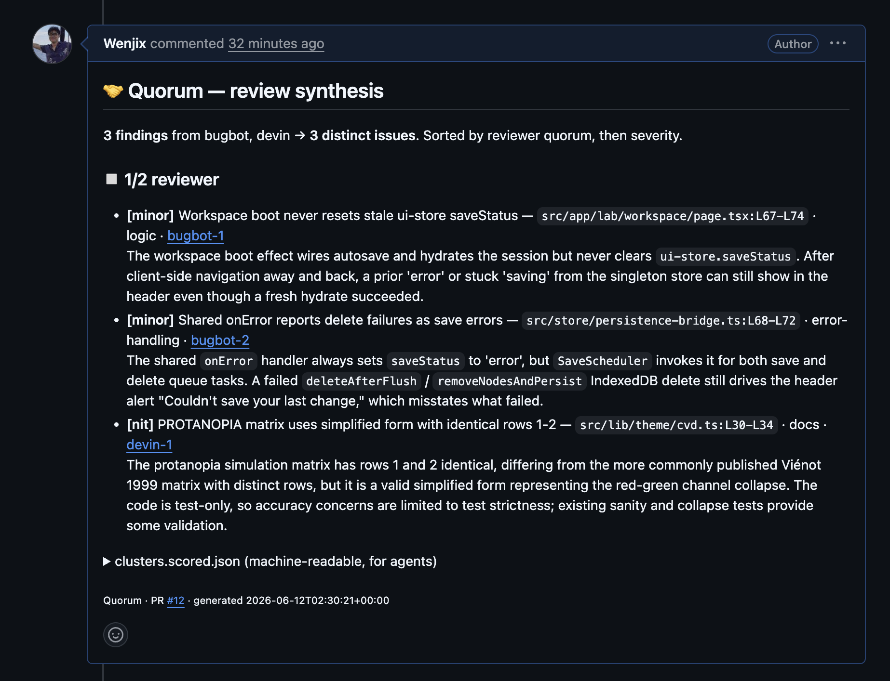
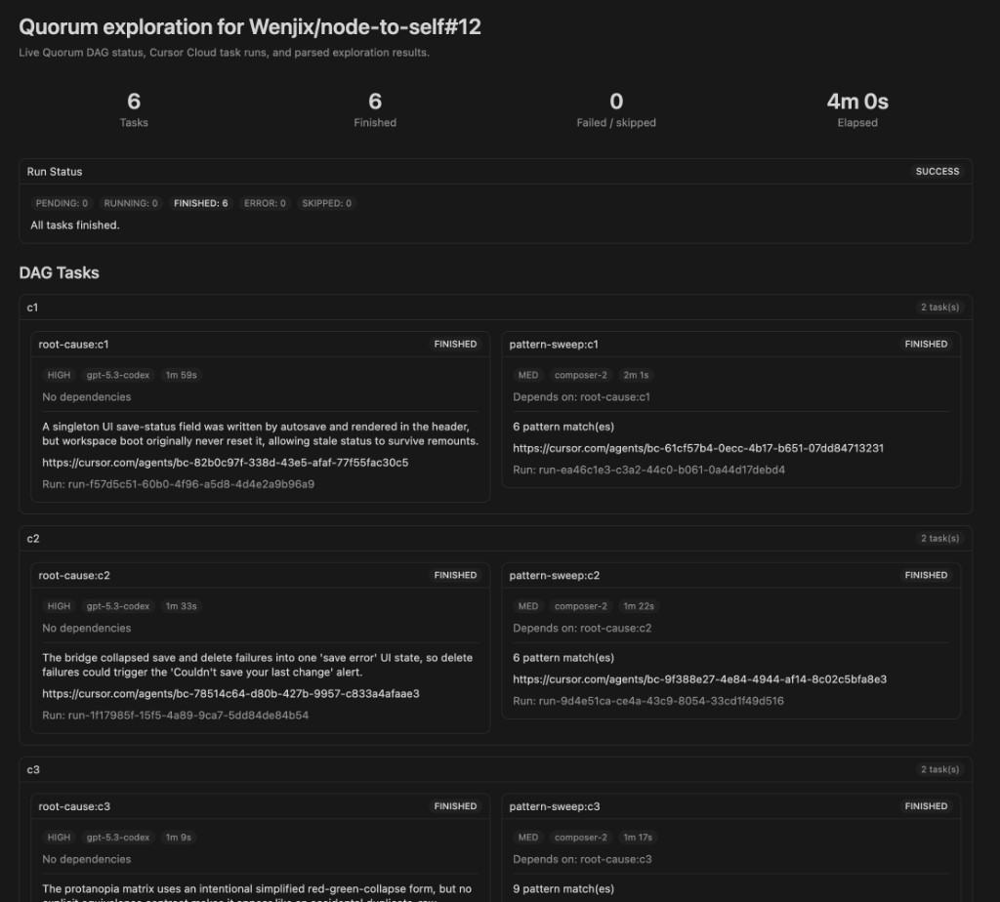

# Quorum

Quorum turns noisy automated PR reviews into one prioritized, explainable review brief.

Modern teams often run several AI reviewers on the same pull request: Cursor Bugbot, GitHub Copilot, Devin Reviewer, CodeRabbit, and others. Each reviewer may catch useful issues, but the result is hard to scan, hard to compare, and hard for follow-up agents to use.

Quorum adds a consensus layer. It groups duplicate findings, highlights where multiple reviewers agree, and can launch cloud agents — Cursor Cloud by default, or Anthropic — to explain root causes and search for similar bug patterns elsewhere in the repository.

## Why It Matters

For reviewers and engineering leads:

- See the issues that multiple reviewers independently found.
- Spend less time reading duplicate comments.
- Understand whether a finding is an isolated bug or a repeated pattern.

For agents and automation:

- Convert review prose into structured JSON.
- Preserve links back to the original review comments.
- Feed downstream agents a clean list of distinct issues instead of raw bot output.

For product teams:

- Make AI review output easier to trust, measure, and improve.
- Build a dataset of which findings were fixed, ignored, or false positives.
- Compare reviewer precision over time by category and quorum level.

## What Quorum Does

Quorum currently has two layers.

1. **Review synthesis skill**
   - Fetches line-anchored bot review comments from a GitHub PR.
   - Clusters comments that describe the same underlying issue.
   - Computes reviewer quorum deterministically.
   - Posts one idempotent synthesis comment back to the PR.

2. **Cloud exploration runner**
   - Reads the scored Quorum clusters.
   - Selects quorum-backed findings, by default `quorum >= 2`.
   - Runs a small DAG of agents for each selected cluster, on a pluggable backend: Cursor Cloud (default) or Anthropic.
   - Produces root-cause analysis, pattern-sweep results, local artifacts, and an optional PR comment.
   - Renders a live-updating Cursor Canvas of the DAG while agents run.

The cloud runner is explore-only today. It does not create commits, push branches, or open fix PRs.

## Example Output

Quorum posts one synthesis comment that groups automated-review findings into distinct issues, shows reviewer quorum, preserves links back to the original bot comments, and embeds machine-readable JSON for follow-up agents.



## How It Works

```text
Bot review comments
        |
        v
Quorum skill
  fetch -> cluster -> validate -> score -> post synthesis
        |
        v
clusters.scored.json
        |
        v
Cloud exploration DAG
  root cause -> pattern sweep -> report
        |
        v
exploration.md + exploration.json + Canvas + optional PR comment
```

## Quick Start

### Requirements

- Node.js 22 or newer
- `npm`
- `gh` CLI, authenticated for the target GitHub repo
- `jq` and `python3` for the skill scripts
- An exploration backend key for live runs: `CURSOR_API_KEY` (default Cursor Cloud backend) or `ANTHROPIC_API_KEY` (with `--provider anthropic`). An authenticated `gh` or `GITHUB_TOKEN` also lets the Anthropic backend fetch the PR diff for code context; it degrades gracefully without one. You can persist keys with `quorum auth` (see [Persisting API keys](#persisting-api-keys)) so you don't need to `export` them every shell.

Install dependencies and build:

```bash
npm install
npm run build
```

For the shortest local commands, link the CLI once:

```bash
npm link
```

After that, use `quorum ...` from any directory. Without `npm link`, replace `quorum` with `node dist/src/cli.js` from this repo.

Run tests:

```bash
npm test
```

## Use the Quorum Skill

The packaged skill is `quorum.skill`. It can be installed into Claude Code or Cursor.

For Claude Code:

```bash
mkdir -p .claude/skills
unzip quorum.skill -d .claude/skills
```

For Cursor:

```bash
mkdir -p .cursor/skills
unzip quorum.skill -d .cursor/skills
```

Then open an agent session on a PR branch and ask:

```text
Use Quorum to triage the bot reviews on this PR.
```

The skill posts a Quorum synthesis comment that embeds `clusters.scored.json`. The Phase 2 runner can recover that JSON from the PR automatically, so you usually do not need to pass a local `--scored` path.

You can also run Phase 1 directly from the CLI without the skill:

```bash
quorum synthesize OWNER/REPO#123
```

This fetches findings, scores clusters deterministically, and upserts the synthesis comment. Add `--dry-run` to preview the comment or `--no-post` to skip posting.

## Use the Cloud Runner

First set the API key for your backend (Cursor Cloud is the default):

```bash
quorum auth                    # interactive menu (recommended)
quorum auth --cursor-key "crsr_..."      # set Cursor Cloud key non-interactively
# or, for the Anthropic backend:
quorum auth --anthropic-key "sk-ant-..." --provider anthropic
```

You can still use environment variables instead of, or to override, the config file (see [Persisting API keys](#persisting-api-keys) for the full resolution order).

Generate the exploration DAG, report shell, and Canvas without making any cloud or GitHub calls:

```bash
quorum plan-pr https://github.com/OWNER/REPO/pull/123
```

Run live exploration but do not post to GitHub:

```bash
quorum run-pr https://github.com/OWNER/REPO/pull/123
```

Run live exploration and upsert the PR exploration comment:

```bash
quorum post-pr https://github.com/OWNER/REPO/pull/123
```

Synthesize and explore in one shot (Phase 1 then Phase 2):

```bash
quorum triage-pr https://github.com/OWNER/REPO/pull/123
```

### Choosing a provider

Exploration runs on a pluggable backend. Cursor Cloud is the default; Anthropic is an alternative.

```bash
--provider cursor|anthropic   Backend to use. Default: cursor (or $QUORUM_PROVIDER).
--api-key KEY                 Override the backend API key for this run.
```

Set the default with the `QUORUM_PROVIDER` environment variable. Each backend has per-complexity default models, overridable with `QUORUM_MODEL_HIGH`, `QUORUM_MODEL_MED`, and `QUORUM_MODEL_LOW` (env vars win over a saved `dag.json`, which wins over these defaults):

| Complexity | Cursor (default) | Anthropic           |
| ---------- | ---------------- | ------------------- |
| HIGH       | `gpt-5.3-codex`  | `claude-opus-4-8`   |
| MED        | `composer-2.5`   | `claude-sonnet-4-6` |
| LOW        | `composer-2.5`   | `claude-haiku-4-5`  |

The Anthropic backend is **code-aware**: it fetches the pull request's unified diff and injects it as the agent's view of the code (capped at 200k characters, read-only — it never edits, commits, or pushes). When the diff cannot be fetched it falls back to a "no code context" note and flags missing evidence rather than guessing, so authenticate `gh` or set `GITHUB_TOKEN` for best results.

### Persisting API keys

`quorum auth` saves API keys and the default provider to a config file so you don't need to `export` them in every shell. The file lives at:

```text
$XDG_CONFIG_HOME/quorum/credentials.json    (or ~/.config/quorum/credentials.json)
```

It is created with mode `0o600` and is never committed. Override the path with the `QUORUM_CONFIG` environment variable.

API key resolution order (highest precedence first):

1. `--api-key` flag on the command line
2. `CURSOR_API_KEY` / `ANTHROPIC_API_KEY` environment variable
3. Persisted config file (set via `quorum auth`)

The default provider resolves the same way: `--provider` flag > `QUORUM_PROVIDER` env var > config file > `cursor`.

```bash
quorum auth                           # interactive menu (recommended)
quorum auth --cursor-key "crsr_..."   # set Cursor Cloud key non-interactively
quorum auth --anthropic-key "sk-ant-..." --provider anthropic
quorum auth --provider anthropic      # change only the default provider
quorum auth --show                    # print masked values
quorum auth --clear                   # remove all stored keys
```

`quorum setup` reads the config file too, so it reports keys as "set" whether they come from the environment or the config file.

Open or regenerate a Canvas from an existing run:

```bash
quorum canvas .quorum/runs/<run-id>
```

Advanced/debug mode is still available:

```bash
quorum explore \
  --repo OWNER/REPO \
  --pr 123 \
  --scored path/to/clusters.scored.json \
  --no-post
```

Useful options:

```bash
--provider NAME          Backend: cursor (default) or anthropic.
--api-key KEY            Override the backend API key.
--cluster ID[,ID]        Explore specific cluster IDs.
--min-quorum N           Default: 2.
--max-clusters N         Limit selected clusters.
--scored PATH            Use a local clusters.scored.json instead of PR recovery.
--out DIR                Write artifacts to a custom directory.
--concurrency N          Default: 4.
--task-timeout-ms N      Default: 1200000.
--dry-run | --no-post    Do not write a PR comment.
--post                   For run-pr only: post the exploration comment after running.
--plan-only              Do not call the cloud backend or GitHub.
--no-stream              Wait for final agent results only (Cursor backend).
--canvas-path PATH       Write the Cursor Canvas artifact to this path.
--no-canvas              Skip Canvas generation.
--no-canvas-mirror       Skip mirroring the Canvas into Cursor's managed canvases directory.
```

### Utility commands

```bash
quorum setup                 Check prerequisites, backend keys, and skill install.
quorum auth                  Persist API keys / default provider to a config file.
quorum eval [--log-dir DIR]  Summarize past run logs (task outcomes, durations).
quorum run-dag --dag dag.json --out DIR --repo OWNER/REPO   Run a saved DAG directly.
```

## Outputs

Each shortcut run writes artifacts under `.quorum/runs/<repo>-pr<N>-<timestamp>/` by default.

- `input.clusters.scored.json`: the Quorum synthesis input
- `dag.json`: the exploration graph
- `state.json`: task status, model, run ID, agent ID, errors, and parsed results
- `exploration.json`: structured root-cause and pattern-sweep output
- `exploration.md`: human-readable report
- `quorum-exploration.canvas.tsx`: Cursor Canvas artifact for visual DAG status and task summaries

When posting is enabled, Quorum upserts one PR comment using the hidden marker:

```html
<!-- quorum:exploration -->
```

Reruns update the existing exploration comment instead of spamming the PR.

## Cursor Canvas Integration

Quorum renders each run as a Cursor Canvas: a live React view showing run status, per-cluster task cards, agent links, and parsed results.



Cursor only renders `.canvas.tsx` files as interactive Canvases when they live in the workspace's managed canvases directory:

```text
~/.cursor/projects/<workspace-slug>/canvases/
```

So in addition to the copy in the run's output directory, Quorum automatically mirrors the Canvas there as `quorum-<repo>-pr<N>.canvas.tsx` (for example `quorum-node-to-self-pr12.canvas.tsx`). The CLI prints both paths:

```text
canvas .quorum/runs/<run-id>/quorum-exploration.canvas.tsx
canvas (Cursor) ~/.cursor/projects/<workspace-slug>/canvases/quorum-node-to-self-pr12.canvas.tsx
```

Click the `canvas (Cursor)` path in Cursor to open it beside the chat. The mirror is skipped when the workspace has never been opened in Cursor, or when `--no-canvas-mirror` or `--no-canvas` is passed.

**Live-updating DAG.** Quorum rewrites both Canvas copies on every task state change — task start, finish, error, and skip — so the Canvas updates in place while root-cause and pattern-sweep agents run: status pills flip from `PENDING` to `RUNNING` to `FINISHED`, durations fill in, and result summaries appear as each agent completes.

You can also re-render a Canvas from a saved run without re-running anything:

```bash
quorum canvas .quorum/runs/<run-id>
```

## Safety Defaults

Quorum treats reviewer consensus as signal, not truth.

- Clustering is conservative: when uncertain, keep findings separate.
- Quorum is computed in code from distinct reviewers, not by the model.
- Cloud exploration is read-only by prompt and by configuration, on both the Cursor and Anthropic backends.
- The Cursor runner sets `autoCreatePR: false`; the Anthropic backend only ever sees the PR diff and is instructed never to edit, commit, or push. Neither asks agents to change files.
- Pattern sweeps classify likely and possible repeats; they do not apply fixes.

## Repository Layout

```text
SKILL.md                 Skill instructions for review synthesis
quorum.skill             Packaged Claude/Cursor skill
src/                     TypeScript cloud runner
test/                    Node test suite
package.json             Build, test, and dependency metadata
```

Key source modules:

- `src/cli.ts`: command-line interface
- `src/dag.ts`: DAG validation, rank computation, and per-provider model defaults
- `src/runner.ts`: task execution and state persistence
- `src/canvas.ts`: Cursor Canvas rendering
- `src/cursor-cloud-adapter.ts`: Cursor Cloud backend
- `src/adapters/anthropic.ts`: Anthropic backend (code-aware via PR diff injection)
- `src/report.ts`: JSON and Markdown exploration reports
- `src/github.ts`: idempotent PR comment upsert and PR diff fetch

## Development

Run type checks:

```bash
npm run typecheck
```

Run the full test suite:

```bash
npm test
```

Build the CLI:

```bash
npm run build
```

After building, the CLI entrypoint is:

```bash
node dist/src/cli.js --help
```

## Current Status

Quorum is built for dogfooding.

It is not yet a hosted GitHub App. The fastest path is still interactive use: run the skill on a PR, inspect the synthesis, then launch cloud exploration for the quorum-backed findings.

Planned next steps:

- Preserve dogfood logs for reviewer precision analysis.
- Add richer evaluation around bad merges and false positives.
- Add optional fix-draft agents after the explore-only flow is reliable.
- Package hosted automation through GitHub Actions or a GitHub App.
